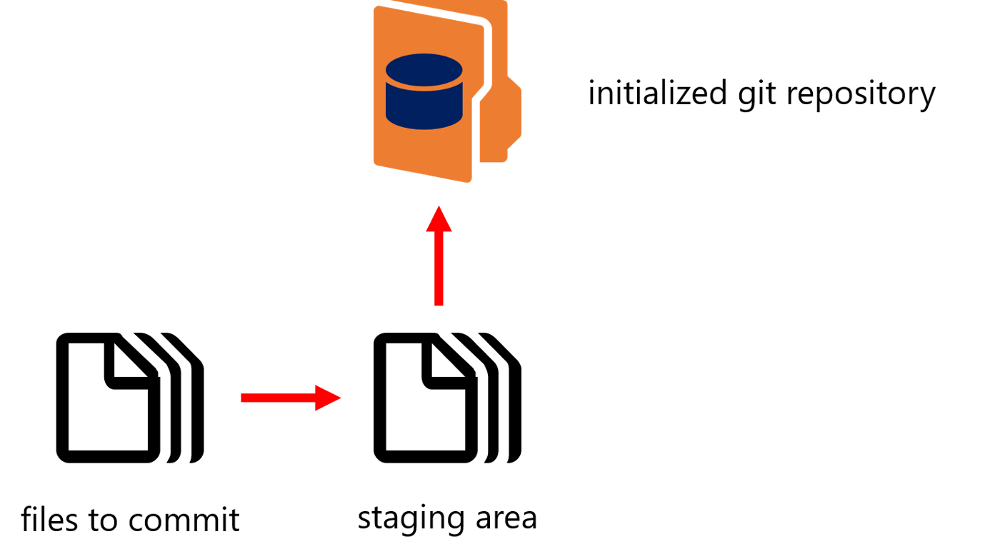

Git Gud with Git, Github and Gradescope
===

Before we begin
---


### CS 50
Today we will be using the cloud-based environment developed by Harvard Universities CS50 program. [code.cs50.io](code.cs50.io). This is an integrated development envirnoment (IDE) and is used explicitely in some courses, for instance Web and Database Computing. It can also be used regardless of your machine either directly in your browser or via [Visual Studio Code](https://code.visualstudio.com/).

Go to [code.cs50.io](code.cs50.io) and connect your Github account. You will need to authorise the application. Follow the prompts.

***A quick side note, I highly recommend enrolling and taking [CS50's Course](https://cs50.harvard.edu/college/2022/spring/) if you're just starting out and have some time on your hands***

#### Git, Github and CS50 IDE (Code50)

As outlined by the [Code50 documentation](https://cs50.readthedocs.io/code/) as the technology utilised by the Code50 [Codespaces](https://github.com/features/codespaces) uses their organisations Github we are blocked from using git within our codespace directly.

```Shell

$ git
You are in a repository managed by CS50. Git is disabled. See https://cs50.ly/git.
```

The documentation states we can use git if we go back a directory.

```Shell
$ pwd
/workspaces/68335119
$ cd ..
$ pwd
/workspaces/
$ git #the output will show correctly and the error will no longer be there
```

Now that we have this set up lets move on. We will run into issues later but we'll tackle them as it comes up.


### What is git?
Git is a free and open source distributed version control system. What is version control? Essentially, it’s a system that allows you to record changes to files over time, thus, you can view specific versions of those files later on.

### Why Use Git?
Over time, Git has become an industry standard for development. Being able to snapshot your code at a specific time is incredibly helpful as your codebase grows and you have to reference previous versions of it.

### How It Works
With Git, you record local changes to your code using a command-line tool, called the “Git Shell” (you can use Git in other command-line tools — I’ll refer to Git Shell through the following sections). Command-line lets you enter commands to view, change, and manage files and folders in a simple terminal, instead of using a graphical user interface (GUI). If you have not used command-line before, don’t worry, once you get started, it is incredibly straightforward.





Essentially, when using Git, you make changes to your code files as you normally would during the development process. When you have completed a coding milestone, or want to snapshot certain changes, you add the files you changed to a staging area and then commit them to the version history of your project (repository) using Git. Below, you’ll learn about the Git commands you use for those steps.


### Terminal Commands
While using Git on the command line, chances are you will also use some basic terminal commands while going through your project and system files / folders, including:

**pwd** - check where you are in the current file system

**ls** - list files in the current directory (folder)

**cd** [directory-name] - moves to the given directory name or path

**mkdir** [directory-name] - makes a new directory with the given name

### Creating Repositories

There are two ways to initially start a Git Repository. The easiest method is via Github but we will get to that later. For now, lets see how to do this via Git.

Remember that Git is solely housed on your computer and is not yet a collaborative tool.

```Shell
$ git init MyFirstRepo
```

This will initialise a blank repository with the branch name main.

```Shell
$ ls
MyFirstRepo
```

We now have folder called MyFirstRepo.

```Shell
$ cd MyFirstRepo
$ ls -la #List all (-a) with further information in a list (-l)
drwxr-xr-x  3 xxx  staff   96 16 Mar 17:19 .
drwxr-xr-x  3 xxx  staff   96 16 Mar 17:19 ..
drwxr-xr-x  9 xxx  staff  288 16 Mar 17:19 .git
```

We can see with the above commands that the MyFirstRepo folder contains a hidder (.) .git folder. This is how Git stores everything. This is outside the scope of the course but is an interesting thing to read up on. For now, just remember if you wish to remove the Git functionality from this folder, you can just remove this .git folder.

### Making Changes

Now that we have a Git repository we can use it to version control our local development.

Lets just create a quick README.md document.

```Shell
$ touch README.md
$ [insert your text editor cmd here] README.md #Yes, Vi, Vim, Emacs, Atom are all the greatest thing since sliced bread. I use VScode like a peasant
```

Write anything you'd like and save (Code50 autosaves).

```Shell
$ git status
```


We can now see that git has seen that we have added a file. This file is currently untracked which means that it is not version controlled right now. lets change that.

```Shell
$ git add * #will add everything from your current directory down, be careful with this.
$ git add *.cpp #will add everything from yoru current directory that is a .cpp file.
$ git add README.md #will add the README.md file as a tracked file.
```


Now it is being picked up as a tracked file and will be included in our first 'commit'.

This is known as a staged file, lets commit it to our repository so we can make further changes without worrying about our current work being lost.

```Shell
$ git commit -m "This is my first commit, i'm so gud"

```

```Shell
$ git log #show me the commit history
commit 5c285f3b22f8505c9384c5151f41ed967728fba5 (HEAD -> main)
Author: [Your details]
Date:   Wed Mar 16 17:46:08 2022 +1030

    This is my first commit, i\'m so gud
```

Using the above command we can see that the current commit is that large string of characters.

This is still all locally housed on your computer but is still version controlling your files.

### How it works


Now lets see how it works with Github


### Overview

In essence, GitHub is a service that allows you to host your Git repositories online and collaborate with others on them. You can use GitHub through their web portal as well as the GitHub desktop GUI and the Git Shell.

As a service, GitHub is now used by 12 million developers and organizations, and has become a fairly popular standard for collaborating on projects and open-sourcing code.

### How it works


With GitHub, you have the same local process of adding and committing files to an initialized Git repository on your computer. However, you can utilize GitHub to push your changes to GitHub’s hosting service. This allows other people to similarly work on the same project, pull your changes to their computers, and push their own changes to GitHub. Continue below to see the commands you can use to utilize Git with GitHub.


### Creating and Copying Repositories

As we all know (I hope) Github is an open source hub of software. This means that the code on Github can be inspected openly and used (in most cases) freely. Always make sure you check their license before using someones code however.

As stated in the previous section you can also initialise a git repository from Github directly. There are two ways to do this.

#### Fork (cannot be done on the command line)


Forking a repository essentially copies that project to your online GitHub account. However, to work on that project on your local computer, you must clone the project.

#### Clone (can be done on the command line)

Cloning a project simply copies a Git repository with its version history, by its url, to your local computer from GitHub. From there, you can make and commit changes of your own to that repository. Any changes you commit and then push to GitHub (see below) are saved for your copy of that project.


Lets try and connect our existing repository to Github so we can share how gud we are with the world.

First we need to ask Github to set aside space on their servers for our Git repo.


Now as shown in the last picture, we have a few options to get content into our new repo. lets connect our initial repo to Github using the 2nd snippet

```Shell
$ git remote add origin https://github.com/<username>/MyFirstRepo.git #create a remote location called origin at the following link to send my repository updates to
$ git push --set-upstream origin main #-u can be used instead of --set-upstream
remote: Write access to repository not granted.
fatal: unable to access 'https://github.com/Melkor118/MyFirstRepo.git/': The requested URL returned error: 403
```

The above will tell our local git repository to talk to the location we created on Github. unfortunately it errors.

This error is caused by us using Code50. It's an authentication issue. As I mentioned earlier, this is using CS50's github and not ours. that means, since MyFirstRepo is private we cannot access it.

Therefor we must provide a [Personal Access Token](https://docs.github.com/en/authentication/keeping-your-account-and-data-secure/creating-a-personal-access-token) to CS50. Take a look at that link as it steps you through creating one.

I recommend setting the expiry date to be for when the semester ends. This token provides ANYONE who has it access to your private repositories. If you already have a strong Github portfolio you may want to create a new account to use for your uni work and you can collate the repos later on.

Now that we have a Personal Access Token to allow CS50 to access our private repos lets put that in our environment.

### Adding your Personal Access Token to Code50

There are a few different ways you can do this and I will leave it to you to decide as to which you use as each have pros and cons regarding security.


#### Change the Environment Variable


#### Include the token in the remote url


Unfortunately these are not persistent. We have tested putting commands in the .bashrc file to make this persistent but it does not get backed up. I am still looking into a persistent method.

#### Create an initialisation script

Another method I use to lower the inconvenience is to make the following command into a script that you can run manually when you start Code50.

```Shell
$ echo "export GITHUB_TOKEN=ghp_YourPersonalAccessToken" >> init.sh #Creates file with the content "export ..."
$ chmod +x init.sh #make it an executable file
$ ./init.sh #run the script
```

This will be backed up if you save it in your workspace and you can just run it when you start up Code50. Downside is your token is in plaintext in a file on the workspace but it won't be in your bash_history.

after doing the above we can now continue.

```Shell
$ git remote add origin https://github.com/<username>/MyFirstRepo.git #create a remote location called origin at the following link to send my repository updates to
$ git push --set-upstream origin main #-u can be used instead of --set-upstream
```

We should get no errors now.


```Shell
Enumerating objects: 3, done.
Counting objects: 100% (3/3), done.
Writing objects: 100% (3/3), 254 bytes | 254.00 KiB/s, done.
Total 3 (delta 0), reused 0 (delta 0), pack-reused 0
To https://github.com/<username>/MyFirstRepo.git
 * [new branch]      main -> main
Branch 'main' set up to track remote branch 'main' from 'origin'.

```

We have now pushed our local git repo to Github.


Lets try another way of creating a new repo. navigate to Github and create a 2nd repo. This time add a README and a .gitignore file using the C template. The .gitignore is a file that tells git to ignore certain files.


Copy the github link as before and clone the repo into Code50.

```Shell
$ git clone https://github.com/<username>/MySecondRepo.git
$ cd MySecondRepo
$ ls -la
drwxrwxrwx+ 3 ubuntu ubuntu 4096 Mar 16 10:08 ./
drwxr-xrwx+ 8 ubuntu root   4096 Mar 16 10:08 ../
drwxrwxrwx+ 8 ubuntu ubuntu 4096 Mar 16 10:08 .git/
-rw-rw-rw-  1 ubuntu ubuntu  430 Mar 16 10:08 .gitignore
-rw-rw-rw-  1 ubuntu ubuntu   14 Mar 16 10:08 README.md
```

We now have a new repo. Lets add a file.

```Shell
$ echo "This is a new file" >> new.txt #this creates a new file that has the contents "This is a new file"
$ git status
Your branch is up to date with 'origin/main'.

Untracked files:
  (use "git add <file>..." to include in what will be committed)
        new.txt

nothing added to commit but untracked files present (use "git add" to track)
$ git add new.txt
$ git commit -m "we added a new file"
$ git push origin main
```
Voila, we have now cloned and updated a repo. This method is usually easier and faster. Notice we didn't need to add the remote, it was already there.

```Shell
$ git remote -v
origin  https://github.com/<username>/MySecondRepo.git (fetch)
origin  https://github.com/<username>/MySecondRepo.git (push)
```

### Branching out

Now that we know how to start up repositories let's talk about how the real world uses Github to develop software.

Branches are a tool used in Github to allow simultaneous development across different versions of the Repo.


The above diagram shows this. We won't need to do this during uni but you can use it if you wish to practice using branches. We will quickly touch on branching now.

To create a branch first ensure your repo is up to date.

```Shell
$ git pull origin main
From https://github.com/<username>/MySecondRepo
 * branch            main       -> FETCH_HEAD
Already up to date.
```

Good now lets create a branch to work on an assignment in our second repo.

```Shell
$ git checkout -b assignment1
Switched to a new branch 'assignment1'
$ git branch
* assignment1
  main
```

We have now created a new branch.

```Shell
$ mkdir assignment1
$ cd assignment1
$ touch assignment1.cpp
$ cd ..
$ git status
On branch assignment1
Untracked files:
  (use "git add <file>..." to include in what will be committed)
        assignment1/

nothing added to commit but untracked files present (use "git add" to track)
```

Note that we are now on the branch assignment1.

let's add, commit and push our changes to the branch assignment1.

```Shell
$ git add assignment1/
$ git commit -m "i am starting assignment1 like a good student"
$ git push origin assignment1

```

Now if you go back to your repo you will see it looks a little different.


We have a new branch which contains different content to our main branch, switch to it by click on the dropdown where main is.


Now to merge the changes into our main branch (perhaps after we have finished our assignment and passed the gradescope testing) we want to request that the main branch PULL the changes from our assignment1 branch.


Github is nice and tells us that it can be merged automatically. That is there is no conflicting changes being made. You hopefully won't come across merge conflicts often but I advise you look at these in your own time.


We have now successfully merged the branch into the main.

```Shell
$ git log #shows us what we have done so

```

Now we have successfully traversed Git and Github.

Again, a reminder that for most of your courses using Gradescope you will need to have a SEPARATE repository for each of your assignments with the files contained in the root of that repository.

This will mean that your github profile will fill up with a lot of small repositories. You can organise them into lists on Github by starring your repository and going to 'Your stars' and creating a new list.


And that concludes the workshop. I am going to continue to investigate a more persistent solution to the Github Authentication issue. We will announce it once it is available.

In the meantime, check out this helpful [git cheatsheet](https://education.github.com/git-cheat-sheet-education.pdf) and work on Gitting Gud.

References
---
1. [Medium article](https://medium.com/@abhishekj/an-intro-to-git-and-github-1a0e2c7e3a2f)
2. [Herewecode article](https://herewecode.io/blog/create-repository-github/)
3. [Personal Access Token article](https://docs.github.com/en/authentication/keeping-your-account-and-data-secure/creating-a-personal-access-token)
4. [Code50 article](https://cs50.readthedocs.io/code/)
5. [Codespace article](https://github.com/features/codespaces)
